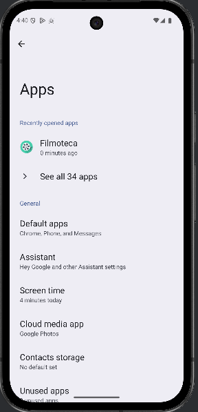
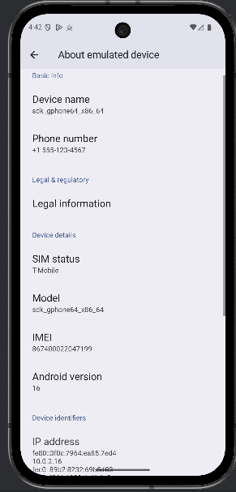

# FIlmoteca - Proyecto para PMDM
Objetivo: Crear una aplicación de Filmoteca utilizando Jetpack Compose en Android Studio, siguiendo una serie de pasos guiados que cubrirán desde la configuración inicial hasta la implementación de funciones avanzadas.

## Introducción
Este proyecto tiene como objetivo crear una aplicación de Filmoteca utilizando Jetpack Compose en Android Studio, 
siguiendo una serie de pasos guiados que cubrirán desde la configuración inicial hasta la implementación de funciones avanzadas.

Desde el inicio se ha construido este repositorio para realizar todas las actualizaciones e implementaciones. En 
este README se encuentran todas las capturas de pantalla de los ejercicios que así lo requieren, y una demostración 
breve de la funcionalidad de la app.

## Ejercicio 1 - Aplicaciones y servicios en ejecución
Al abrir el apartado de aplicaciones nos encontramos con toda la informacion sobre las aplicaciones que se 
encuentran en ejecución así como las instaladas, las que están establecidas por defecto y las que no se han usado nunca.

## Ejercicio 2 - Versiónd de Android
 En este apartado podemos encontrar información tanto del software como del hardware del dispositivo.

La versión de Android utilizada es la 16.0

## Ejercicio 5 - Probando la aplicación
No poseo un terminal Android físico, por lo que he empleado el AVD con un teléfono Pixel 9a

## Ejercicio 21 - Filtrado de logs
Utilizamos tags para poder filtrar los logs en logcat:

## Ejercicio 22 - Pruebas con monkey
Monkey no detecta errores salvo uno de permisos al no tener el dispositivo rooteado:

