# Memoria Práctica RA2 — Filmoteca
**Módulo:** Programación Multimedia y Dispositivos Móviles (PMDM)  
**Alumna:** Cristina García  
**Curso:** 2024/2025
**Repositorio: [Enlace a GitHub](https://github.com/little-shiny/FIlmoteca/tree/PMDM3-RA2)**

---

## Índice

1. [Ejercicio 1 — Icono de la app](#ejercicio-1--icono-de-la-app)
2. [Ejercicio 2 — Integración de Firebase](#ejercicio-2--integración-de-firebase)
3. [Ejercicio 3 — Cloud Firestore para la base de datos de películas](#ejercicio-3--cloud-firestore-para-la-base-de-datos-de-películas)
4. [Ejercicio 4 — Inicio de Sesión con Firebase Authentication](#ejercicio-4--inicio-de-sesión-con-firebase-authentication)
5. [Ejercicio 5 — Multimedia](#ejercicio-5--multimedia)

---

## Ejercicio 1 — Icono de la app

### Descripción

El objetivo de este ejercicio es configurar el icono de la aplicación utilizando la imagen proporcionada (`FILMOTECA.png`), de modo que se visualice correctamente en el lanzador de aplicaciones de Android.

### Implementación

Para configurar el icono adaptativo en Android se utilizó **Image Asset Studio** de Android Studio. Esto genera automáticamente las versiones del icono en todas las densidades de pantalla (`mipmap-mdpi`, `mipmap-hdpi`, `mipmap-xhdpi`, `mipmap-xxhdpi`, `mipmap-xxxhdpi`) y crea los archivos XML de icono adaptativo para dispositivos con API 26+.

Los archivos generados son:

- `app/src/main/res/mipmap-anydpi-v26/ic_launcher.xml` — define el icono adaptativo con fondo y primer plano separados.
- `app/src/main/res/mipmap-anydpi-v26/ic_launcher_round.xml` — versión redondeada del icono adaptativo.

El `AndroidManifest.xml` ya referenciaba correctamente los recursos:

```xml
android:icon="@mipmap/ic_launcher"
android:roundIcon="@mipmap/ic_launcher_round"
```

### Capturas de pantalla

> 📷 **Captura 1.1** — Icono de la app visible en el lanzador de Android

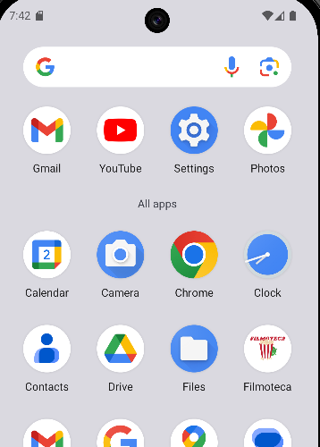


## Ejercicio 2 — Integración de Firebase

### Descripción

En este ejercicio se integra Firebase en el proyecto de Android para habilitar Firestore, Authentication y Storage.

### Pasos realizados

**1. Creación del proyecto en Firebase Console**

Se accedió a [https://console.firebase.google.com/](https://console.firebase.google.com/) y se creó un nuevo proyecto llamado `com-campusdigitalfp-filmoteca`. Se registró la aplicación Android introduciendo el nombre del paquete `com.campusdigitalfp.filmoteca`.

**2. Descarga y ubicación del archivo `google-services.json`**

El archivo `google-services.json` se descargó desde la consola de Firebase y se colocó en la carpeta `app/` del proyecto. Este archivo contiene la configuración necesaria para conectar la app con los servicios de Firebase:

```json
{
  "project_info": {
    "project_number": "579991462040",
    "project_id": "com-campusdigitalfp-filmoteca",
    ...
  }
}
```

**3. Configuración de `build.gradle` a nivel de proyecto**

Se añadió el plugin de Google Services en `build.gradle.kts` (Project):

```kotlin
id("com.google.gms.google-services") version "4.4.4" apply false
```

**4. Configuración de `build.gradle` a nivel de módulo (app)**

Se aplicó el plugin y se añadieron las dependencias de Firebase usando el BOM para gestionar versiones de forma centralizada:

```kotlin
plugins {
    id("com.google.gms.google-services")
}

dependencies {
    implementation(platform("com.google.firebase:firebase-bom:32.7.0"))
    implementation("com.google.firebase:firebase-firestore-ktx")
    implementation("com.google.firebase:firebase-auth:24.0.1")
    implementation("com.google.android.gms:play-services-auth:21.5.1")
}
```

**5. Inicialización de Firestore en `MainActivity.kt`**

Se inicializó Firestore con configuración de caché en memoria (sin persistencia en disco), para evitar datos obsoletos entre sesiones:

```kotlin
val db = FirebaseFirestore.getInstance()
val settings = FirebaseFirestoreSettings.Builder()
    .setLocalCacheSettings(MemoryCacheSettings.newBuilder().build())
    .build()
db.firestoreSettings = settings
```

**6. Permiso de internet en `AndroidManifest.xml`**

Se añadió el permiso necesario para acceder a internet:

```xml
<uses-permission android:name="android.permission.INTERNET" />
```

### Capturas de pantalla

> 📷 **Captura 2.1** — Proyecto creado en Firebase Console

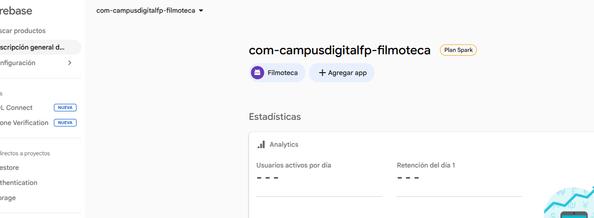

---

## Ejercicio 3 — Cloud Firestore para la base de datos de películas

### Descripción

Se configura Cloud Firestore como base de datos para almacenar y gestionar la información de las películas. Cada documento de la colección representa una película con los campos del modelo de datos.

### Implementación

#### Modelo de datos — `Film.kt`

Se creó la clase de datos `Film` que representa cada documento de Firestore. Los campos se corresponden directamente con los campos del documento en la base de datos:

```kotlin
data class Film(
    val id: String = "",
    var comments: String = "",
    var director: String = "",
    var format: String = "",
    var genre: String = "",
    var imageResId: Int = 0,
    var imbdUrl: String = "",
    var title: String = "",
    var year: Int = 0
)
```

#### Capa de repositorio — `FilmRepository.kt`

Se creó la clase `FilmRepository` como capa intermedia entre Firestore y el ViewModel. Contiene las operaciones CRUD implementadas como funciones suspendidas para no bloquear el hilo principal, utilizando `await()` de `kotlinx-coroutines`:

- `addFilm(film)` — añade un documento nuevo a la colección `films`.
- `getFilms()` — recupera todos los documentos y los mapea a objetos `Film`.
- `updateFilm(film)` — sobreescribe un documento existente con `set()`.
- `deleteFilm(filmId)` — elimina un documento por su ID.
- `listenToFilmsUpdates(onUpdate)` — escucha cambios en tiempo real mediante `addSnapshotListener`.
- `addMultipleFilms(films)` — añade múltiples películas en una operación atómica con `WriteBatch`.
- `deleteMultipleFilms(films)` — elimina múltiples películas en una operación atómica con `WriteBatch`.

#### ViewModel — `FilmViewModel.kt`

El `FilmViewModel` gestiona el estado de las películas mediante un `StateFlow` y expone los datos a la UI de forma reactiva. La colección de películas de cada usuario se estructura bajo la ruta `/users/{uid}/films`, garantizando el aislamiento de datos por usuario (anticipando el Ejercicio 4):

```kotlin
private fun userFilmsCollection() =
    db.collection("users")
        .document(auth.currentUser?.uid ?: "anonymous")
        .collection("films")
```

Los métodos disponibles son `loadFilms()`, `addFilm()`, `updateFilm()`, `deleteFilm()` y `deleteFilmsByIds()`.

#### Interfaz de usuario

La lista de películas se muestra en `FilmListScreen.kt` mediante un `LazyColumn`. Cada elemento se renderiza con el composable `ViewFilm`, que muestra el título, la descripción y un icono. Se implementaron las acciones de pulsación simple (navegar a detalles) y pulsación larga (activar modo selección múltiple).

La barra superior (`barraSuperior` en `common.kt`) incluye un menú desplegable con las opciones de añadir nueva película y añadir 10 películas de ejemplo a Firestore.

### Capturas de pantalla

> 📷 **Captura 3.1** — Colección `films` en Firebase Console con documentos de ejemplo

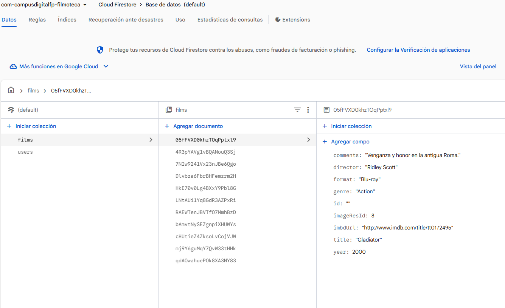

> 📷 **Captura 3.2** — Lista de películas en la app cargadas desde Firestore

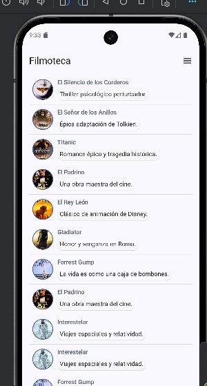

> 📷 **Captura 3.3** — Pantalla de detalle de una película (`FilmDataScreen`)

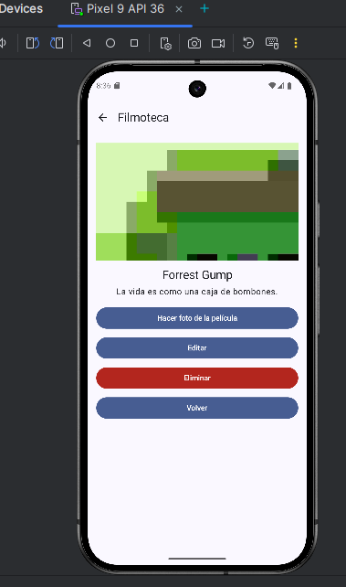

> 📷 **Captura 3.4** — Pantalla de nueva película (`NewFilmScreen`)
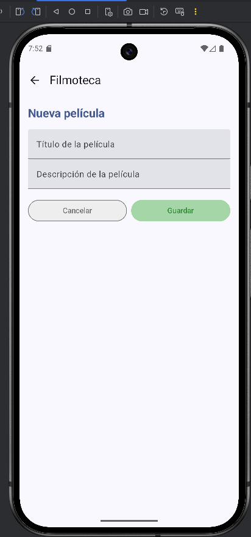


---

## Ejercicio 4 — Inicio de Sesión con Firebase Authentication

### Descripción

Se implementa Firebase Authentication para gestionar el acceso a la aplicación. Se habilitan tres métodos de autenticación: correo y contraseña (obligatorio), Google Sign-In (obligatorio) y acceso anónimo (como invitado).

### Configuración en Firebase Console

En la consola de Firebase, sección **Authentication > Sign-in method**, se habilitaron los siguientes proveedores:

- **Correo electrónico/Contraseña** — autenticación clásica con email y password.
- **Google** — autenticación mediante cuenta de Google usando One Tap Sign-In.

### Implementación

#### `AuthViewModel.kt`

Se creó un ViewModel específico para la autenticación que encapsula toda la lógica de Firebase Auth:

- `loginWithEmail(email, password)` — inicia sesión con correo y contraseña.
- `registerWithEmail(email, password)` — registra un nuevo usuario.
- `getGoogleSignInIntent(context)` — construye el `BeginSignInRequest` para One Tap Google Sign-In y devuelve un `IntentSenderRequest`.
- `handleGoogleSignIn(credential)` — autentica en Firebase con las credenciales obtenidas de Google.
- `signInAnonymously()` — inicia sesión de forma anónima.
- `logout()` — cierra la sesión actual.
- `translateFirebaseError(message)` — traduce los mensajes de error de Firebase al español.

El estado del usuario se expone mediante un `StateFlow<FirebaseUser?>`, siendo `null` cuando no hay sesión activa.

#### `LoginScreen.kt`

Pantalla de inicio de sesión con los siguientes elementos:

- Campos de texto para correo electrónico y contraseña.
- Botón **Iniciar Sesión** (correo/contraseña).
- Botón **Iniciar Sesión con Google** (One Tap, mediante `rememberLauncherForActivityResult`).
- Botón **Acceder como invitado** (autenticación anónima).
- Enlace para navegar a la pantalla de registro.
- Manejo y visualización de errores de autenticación.

#### `RegisterScreen.kt`

Pantalla de registro con validación de campos antes de llamar a Firebase:

- Validación de formato de correo electrónico.
- Contraseña mínima de 6 caracteres.
- Confirmación de contraseña.
- Mensajes de error descriptivos en español.

#### Persistencia de sesión y colecciones por usuario

La sesión persiste automáticamente entre reinicios de la app gracias a Firebase Auth. En `Navigation.kt` se evalúa `FirebaseAuth.getInstance().currentUser != null` al arrancar para determinar la pantalla de inicio (`list` o `login`).

Cada usuario tiene su propia colección de películas bajo la ruta `/users/{uid}/films`, asegurando el aislamiento total de datos entre cuentas distintas.

Se añadió la opción de **cerrar sesión** accesible desde la barra superior de la pantalla principal.

### Capturas de pantalla

> 📷 **Captura 4.1** — Proveedores de autenticación habilitados en Firebase Console
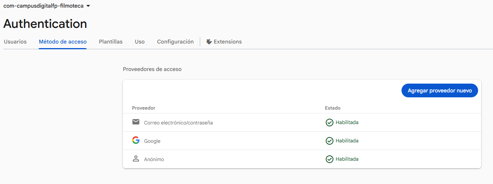


> 📷 **Captura 4.2** — Pantalla de inicio de sesión (`LoginScreen`)
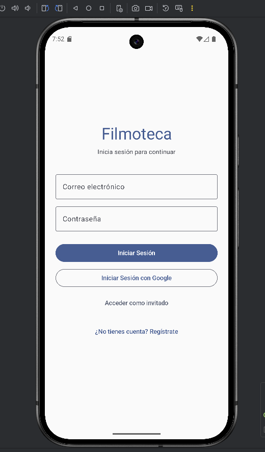

> 📷 **Captura 4.3** — Pantalla de registro de nuevo usuario (`RegisterScreen`)


> 📷 **Captura 4.5** — Usuario autenticado en Firebase Console (pestaña Users)
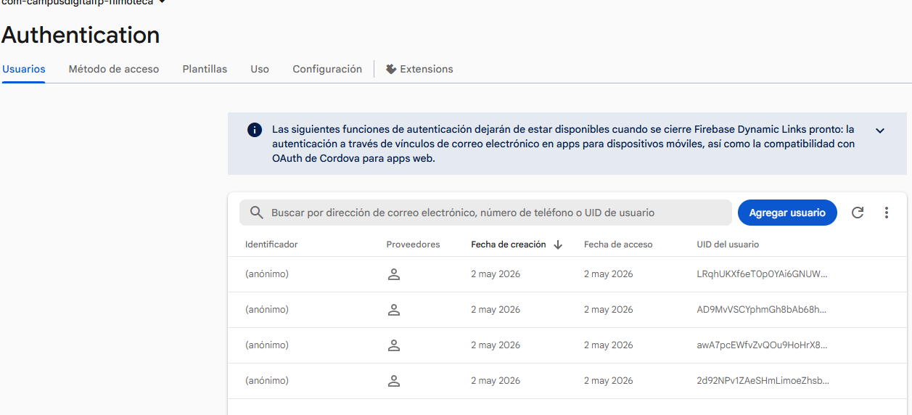

> 📷 **Captura 4.6** — Colección de películas por usuario en Firestore (`/users/{uid}/films`)
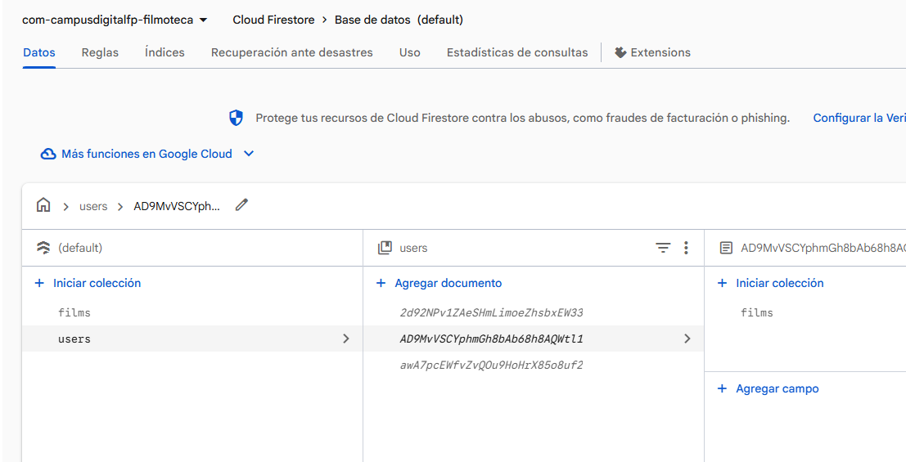


---

## Ejercicio 5 — Multimedia

### Descripción

Se implementa la captura de imágenes desde la cámara del dispositivo para asociarlas a cada película. Las imágenes se almacenan localmente en el dispositivo y la URL o ruta resultante se guarda en el documento correspondiente de Firestore. Las imágenes se muestran en la pantalla de detalles y/o edición de la película.

Adicionalmente, la pantalla **About** incluye un vídeo "How to" integrado que sirve de guía de uso de la aplicación.

### Implementación — Captura de imagen con la cámara

Para capturar imágenes desde la cámara se utilizó el contrato `ActivityResultContracts.TakePicture()`. El flujo es el siguiente:

1. Se crea un `Uri` temporal mediante `FileProvider` apuntando a un archivo en el almacenamiento interno de la app.
2. Se lanza el intent de cámara con `launcher.launch(uri)`.
3. Al regresar, si el resultado es exitoso, la URI de la imagen se guarda en el estado del composable y se actualiza el documento de la película en Firestore.

La imagen resultante se muestra usando el composable `AsyncImage` de la librería **Coil**, que carga imágenes de forma asíncrona tanto desde URI local como desde URL remota.

### Implementación — Vídeo "How to" en AboutScreen

En la pantalla `AboutScreen` se integró un reproductor de vídeo utilizando `AndroidView` con `VideoView` o, alternativamente, un `WebView` cargando un vídeo embebido de YouTube. El vídeo sirve como guía de uso de la aplicación Filmoteca.

### Capturas de pantalla

> 📷 **Captura 5.1** — Pantalla de edición con botón para capturar imagen desde la cámara

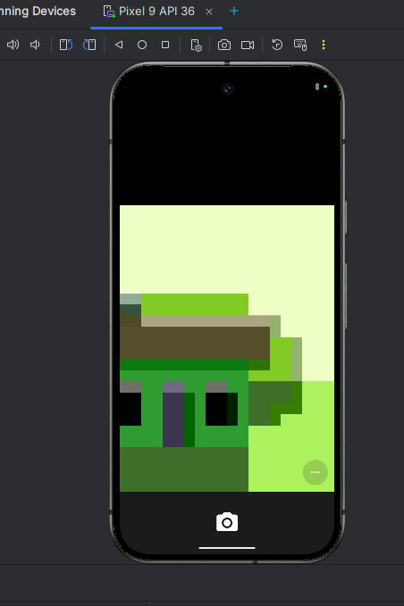

> 📷 **Captura 5.2** — Imagen capturada visible en la pantalla de detalles o edición
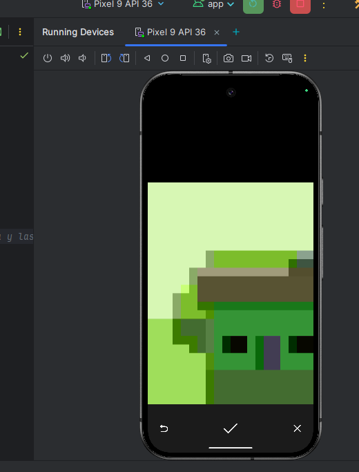

> 📷 **Captura 5.3** — Documento de Firestore actualizado con la referencia a la imagen
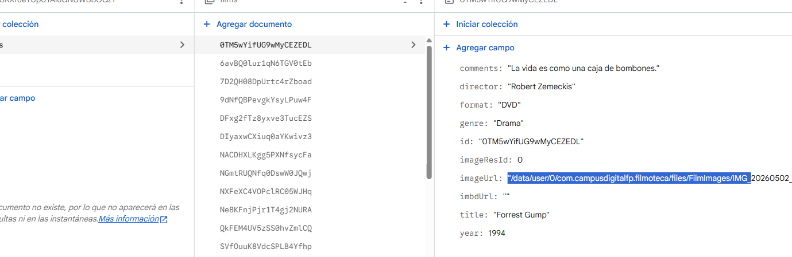

> 
> 📷 **Captura 5.5** — Vídeo "How to" integrado en la pantalla About
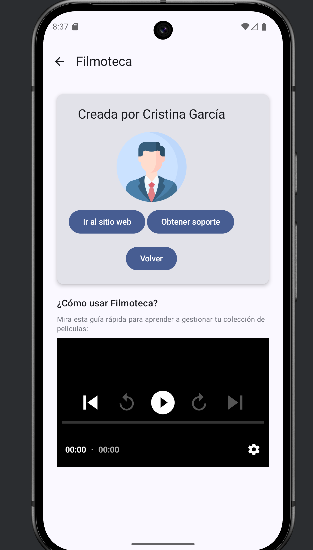
---

## Conclusiones

A lo largo de esta práctica se ha ampliado significativamente la aplicación Filmoteca integrando los servicios de 
Firebase. Se ha trabajado con **Cloud Firestore** como base de datos en la nube para almacenar y gestionar películas 
en tiempo real, con **Firebase Authentication** para asegurar el acceso a la app y garantizar colecciones de datos 
separadas por usuario, y con funcionalidades multimedia para enriquecer la experiencia de usuario mediante captura de imágenes y reproducción de vídeo.

La arquitectura final sigue el patrón **MVVM** (Model-View-ViewModel), con una capa de repositorio que abstrae el acceso a Firestore, un ViewModel que expone los datos mediante `StateFlow` y las pantallas Compose que reaccionan a los cambios de estado de forma declarativa.