# Filmoteca - Proyecto para PMDM

## Introducción
Este proyecto tiene como objetivo crear una aplicación de Filmoteca utilizando Jetpack Compose en Android Studio, 
siguiendo una serie de pasos guiados que cubrirán desde la configuración inicial hasta la implementación de funciones avanzadas.

Desde el inicio se ha construido este repositorio para realizar todas las actualizaciones e implementaciones. En 
este README se encuentran todas las capturas de pantalla de los ejercicios que así lo requieren, y una demostración 
breve de la funcionalidad de la app.

## Ejercicios con capturas de pantalla
### Ejercicio 1 - Aplicaciones y servicios en ejecución
Al abrir el apartado de aplicaciones nos encontramos con toda la información sobre las aplicaciones que se 
encuentran en ejecución así como las instaladas, las que están establecidas por defecto y las que no se han usado nunca.

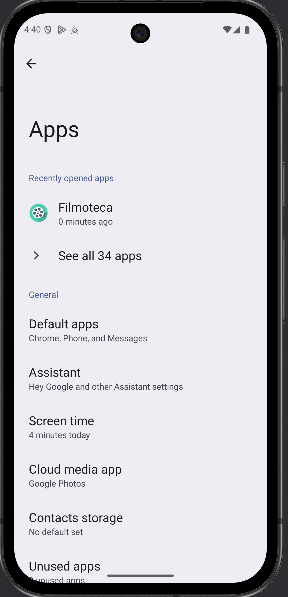

### Ejercicio 2 - Versión de Android
En este apartado podemos encontrar información tanto del software como del hardware del dispositivo.

La versión de Android utilizada es la 16.0

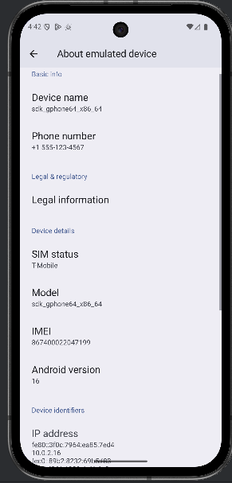

### Ejercicio 5 - Probando la aplicación
No poseo un terminal Android físico, por lo que he empleado el AVD con un teléfono Pixel 9a

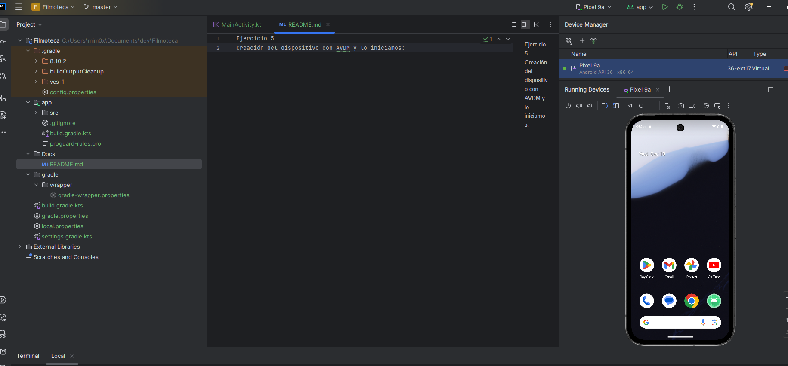

### Ejercicio 21 - Filtrado de logs
Utilizamos tags para poder filtrar los logs en logcat cada vez que se realice un cambio en la pantalla FilmEditScreen

### Ejercicio 22 - Pruebas con monkey
Monkey no detecta errores salvo uno de permisos al no tener el dispositivo rooteado:

## Demo de la app Filmoteca:

Aquí una breve demostración de las funcionalidades más importantes de la app:

https://github.com/user-attachments/assets/af6572aa-1ff4-47d5-830e-1929e5dd3753

# PMDM3 - Práctica RA2
## Ejercicio 1 - Agregar Firebase al proyecto
Se configura en Firebase el nuevo proyecto de Filmoteca:
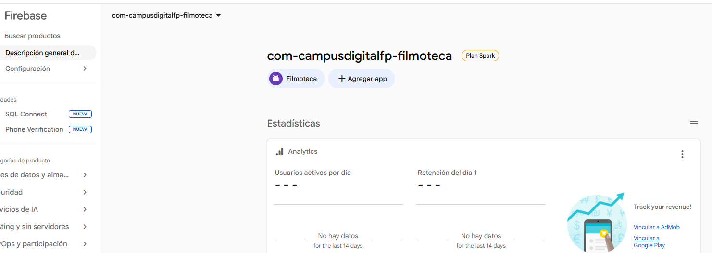

Para añadirlo a nuestro proyecto se configura en los archivos `build.gradle` tanto a nivel de proyecto como a nivel 
de app los plugins y las dependencias necesarias: 
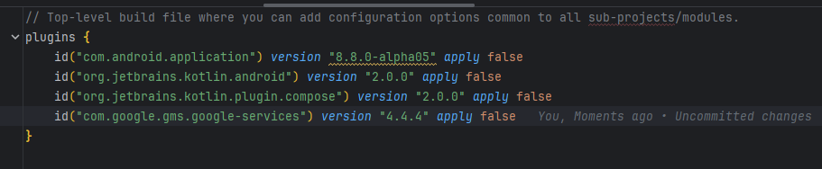
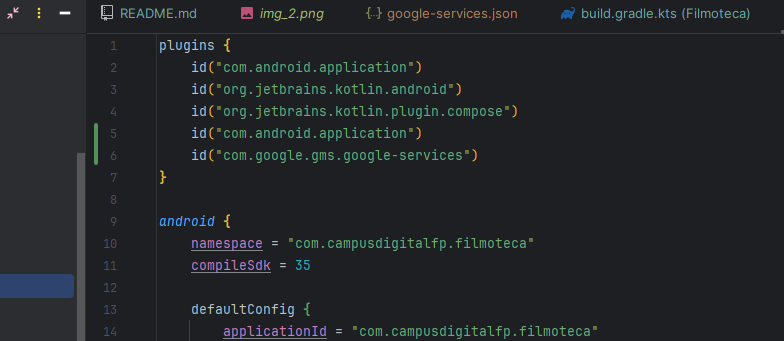

## Ejercicio 2 - Utilizar Cloud Firestore para la base de datos de las películas
### Configuración de la base de datos
Para realizar este apartado debemos comenzar creando la base de datos en Cloud firestore. Para ello se hace mediante 
la consola web: 
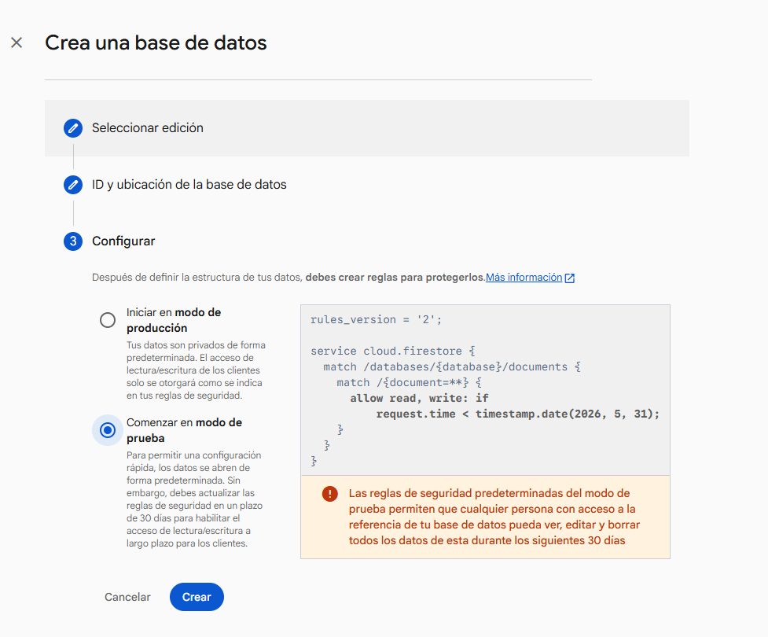

Posteriormente hay que añadir las dependencias al proyecto y sincroniozarlo. Se resolvieron errores de 
comaptibilidad en las dependencias. Después s eincializa la base de datos en `MainActivity.kt` y se crea la base de 
datos en Firestore:
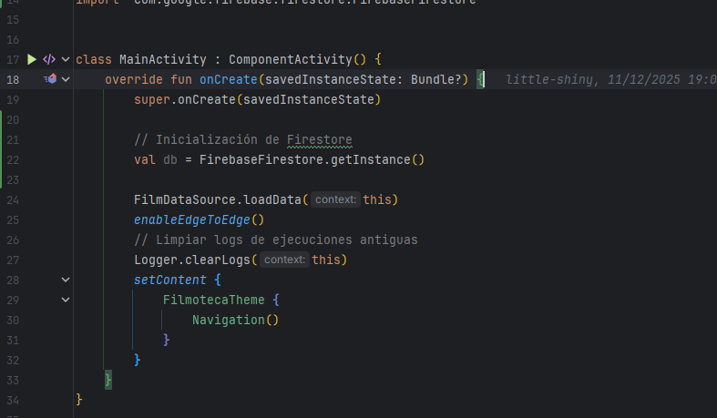

### Creación del modelo de datos `Film`
Para la lógica de la app se crea la colección en Firestore para las películas. Se incluyen los campos que se manejan 
en la aplicación: 
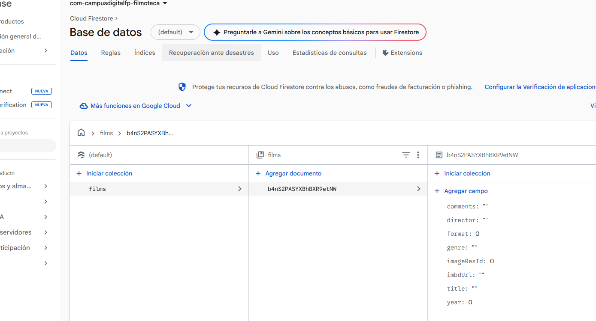

En segundo lugar se establece una clase de datos llamada `Film.kt` en la cual establecemos esos campos para poder 
manejarlos en nuestra app:
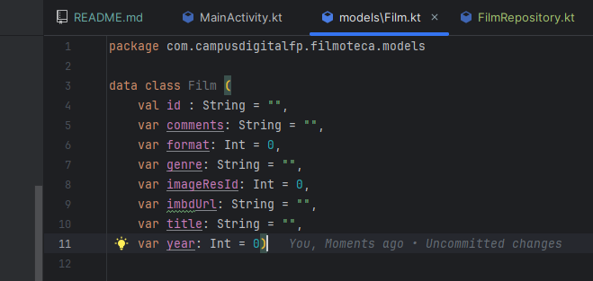

Para poder manejar estos campos desde la base de datos, se realiza una abstracción con el modelo `Repository`, 
mediante el cual se añade una capa intermedia que maneja las operaciones entre Firebase y nuestra app. Para ello 
también se establece una clase propia llamada `FilmRepository`

En esta clase se han creado las operaciones básicas  como funciones suspendidas para no bloquear el hilo principal 
de la aplicación.

#### Creación de un ViewModel para el manejo de datos
En Compose el viewModel permite gestionar los datos de forma mas eficiente y de manera que esté sincronizada. Actúa 
como un intermediario entre la UI y el respoitorio de datos. para ello se ha creado la clase `FilmViewModel.kt`

En esta clase se incorporan métodos patra actualizar la UI con los cambios en la base de datos.
Además, incorpora un método que añade 10 películas de ejemplo a firebase:
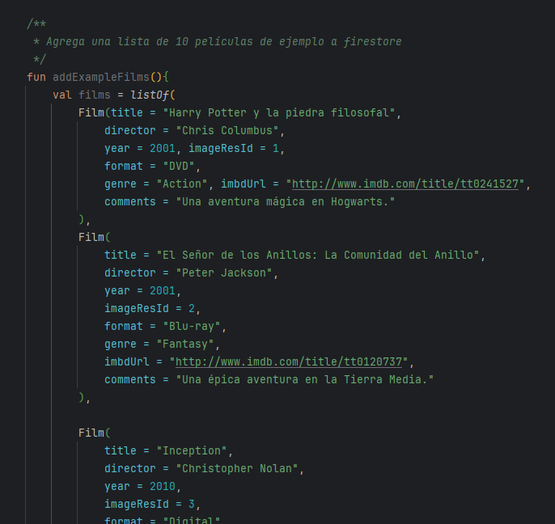

En último lugar se ha incorporado a `androidManifest.xml` los permisos para poder acceder a internet desde la app.

#### Modificaciones `Navigation.kt`
Para poder utilizar este nuevo sistema de almacenamiento de películas, debemos pasar el viewModel a las pantallas de 
la aplicación para que se puedan utilizar los datos. Para ello, se han modificado algunos fragmentos en la clase 
`Navigation.kt`. El aspecto más llamativo es la adición de una clase `enum` para organizar las rutas a las pantallas 
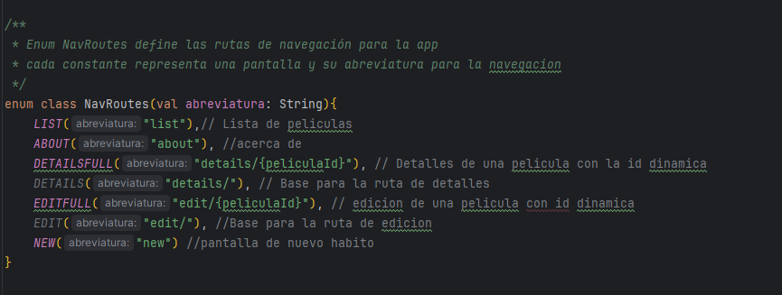

Se ha reescrito el código de navegación para aceptar la ruta mediante la clase `NavRoutes` y utilzando el viewModel
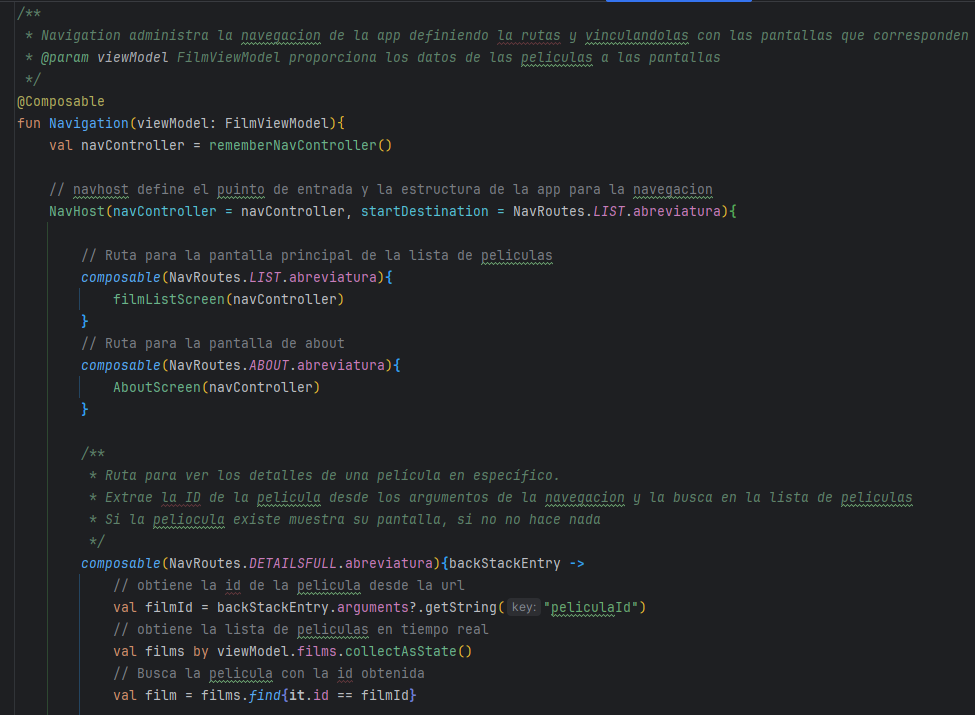

#### Modificaciones FilmListScreen.kt
Para adaptar la pantalla principal se ha reescrito el código con el nuevo sistema de navegación con `NavRoutes`.
Además se ha eliminado la Vista de `Card` para cada película individual, así como para la lista que se pide de todas 
las películas con el LazyColumn, que se nombre como `ViewFilmList` 
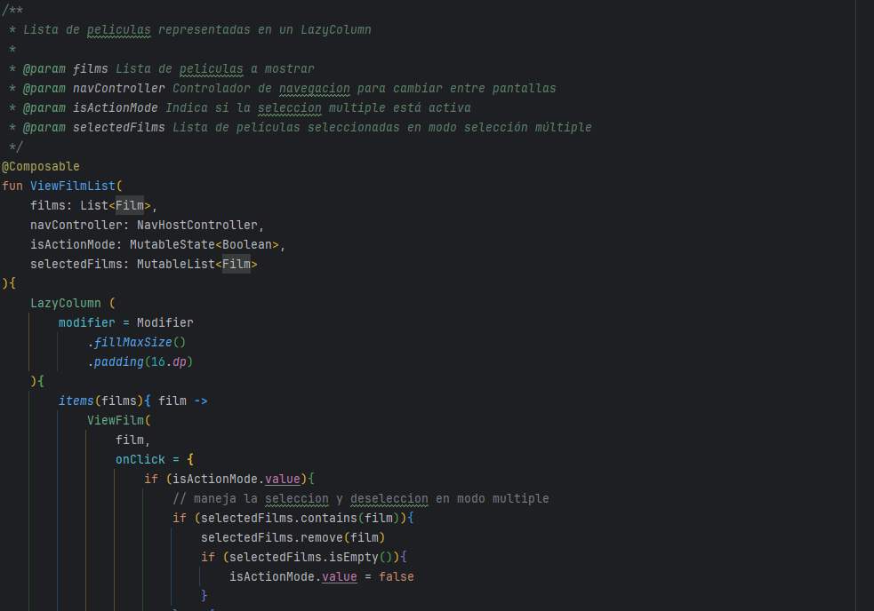

También se maneja con `onClick()` y `onLongClick()` la selección multiple de las películas

